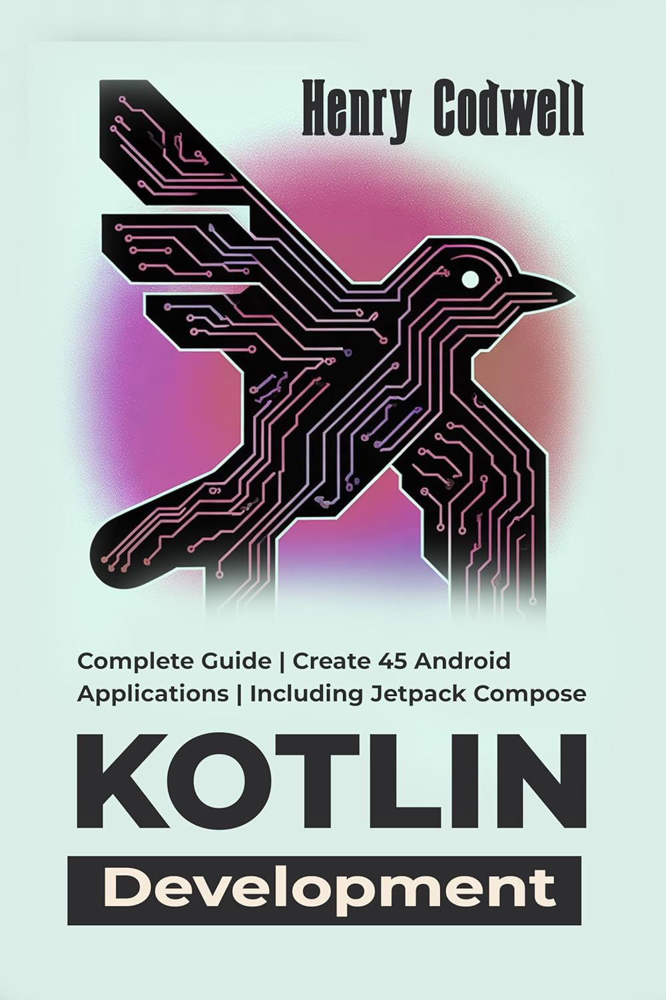

# Kotlin Development: Complete Guide | Create 45 Android Applications | Including Jetpack Compose

- Master modern Kotlin for Android, with clear explanations of syntax, object-oriented and functional paradigms, coroutines, and null safety

- Build 45 Android apps, from basic utilities like calculators and to-do lists to complex systems like e-commerce, social networks, and chat platforms

- Explore Jetpack Compose, Google's modern declarative UI toolkit, and seamlessly integrate it with legacy XML code

- Harness architecture components, Room databases, Retrofit networking, Hilt for dependency injection, Firebase for backends, and more

- Create monetizable, production-ready apps with features like in-app purchases, ads, and Play Store deployment

- Push the boundaries with cross-platform Kotlin Multiplatform Mobile (KMM), advanced UI/UX, and AI-enhanced features

# Image Cover

# Link to book

[Kotlin Development: Complete Guide Book](https://www.amazon.com/Kotlin-Development-Complete-Applications-Including-ebook/dp/B0FFTRC6CM/)
